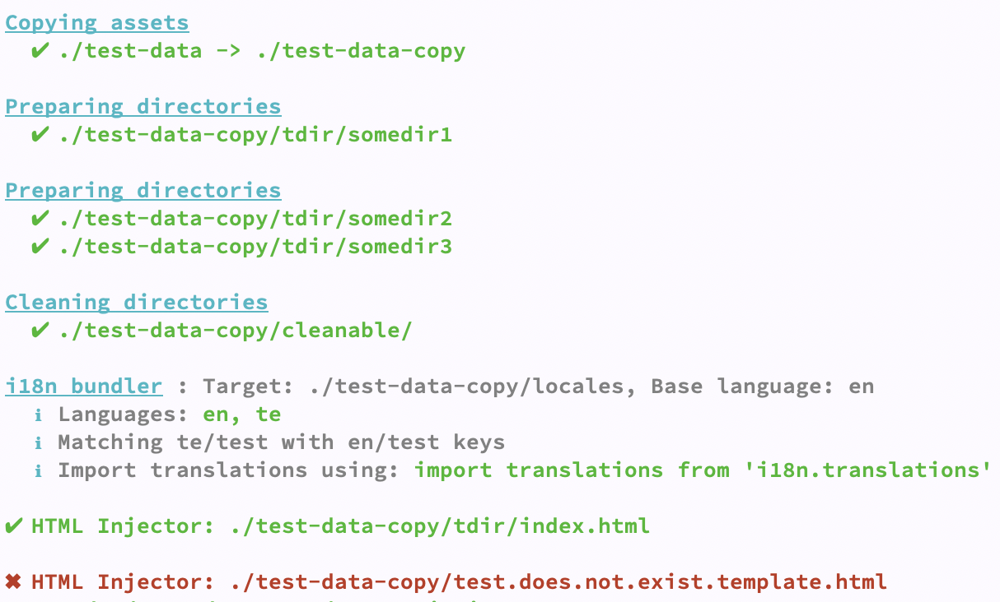

<h1 align="center">rollup-plugin-app-utils</h1>
<div align="center"> Common rollup build utils for i18n, prepare & clean directories, copy assets & html injects</div>
<br />

## Table of Contents
- [i18nBundler](#i18nbundler)
- [copyAssets](#copyassets)
- [prepareDirectories](#preparedirectories)
- [htmlInjector](#htmlinjector)
- [emptyDirectories](#emptydirectories)
- [Contributing](#contributing)

#### Usage:

```javascript
  import Utils from 'rollup-plugin-app-utils'
```
   
#### Output screenshot:   

    
    
##### i18nBundler()

```javascript
  Utils.i18nBundler({
    target: localesDir,
    baseLanguage: 'en',
    // Optional
    transformer: (lang, data) => {
      return data
    }
  })
```

then in your JS import translations using below line

```javascript
  import translations from 'i18n.translations'
  console.log(translations.en)
```

i18n bundler reads json files from the specified directory and prepares a JSON structure. It uses base language directory as reference directory and 

- Adds missing files, adds missing keys to all the other languages
- Removes keys from other languages JSON files that are removed from base language
- Creates files or remove unnecessary files. For exeample, home.json exists in `en` folder but not in `te` folder, then when you build, the i18nBundler will create file and copy the content from base language folder for you. In a same way, if `te` folder contains `test.json` but `en` folder does not, then `test.json` will be removed from the `te` folder 

For example, if you have locales folder with this structure and content, 

```json
{
  "en": {
    "onlyEng.json": {
      "wasInENonly": "yes"
    },
    "test.json": {
      "willbeAdded": "willbeAdded",
      "willnotOverride": "en text"
    }
  },
  "te": {
    "test.json": {
      "willbeRemoved": "willbeRemoved",
      "willnotOverride": "te text"
    }
  }
}
```

it will be transformed to below:

```json
{
  "en": {
    "onlyEng": {
      "wasInENonly": "yes"
    },
    "test": {
      "willbeAdded": "willbeAdded",
      "willnotOverride": "en text"
    }
  },
  "te": {
    "onlyEng": {
      "wasInENonly": "yes"
    },
    "test": {
      "willbeAdded": "willbeAdded",
      "willnotOverride": "te text"
    }
  }
}
```

Please check `test-data` folder for example structure. Then run `npm test` and take a look at `test-data-copy/output.js` and `test-data-copy/locales` for a better understanding.


##### copyAssets()

Helps to copy static content from during build, this does the job in a synchronous way.

```javascript
  Utils.copyAssets({
    // Source -> Target.
    './test-data': './test-data-copy',
    './test': './test-new'
  }, filterFun) // uses fs-extra `copySync`. You can also pass filter function
```

##### prepareDirectories()
<code></code>
Helps to prepare directories during build, this does the job in a synchronous way. For example, during thee build if you want to use dynamically named folder name, this method can be used to create directories. We use this to create a folder with unique name and then put static content in it.

```javascript
  Utils.prepareDirectories(somedir1)
  // or
  Utils.prepareDirectories([somedir2, somedir3])
```


##### emptyDirectories()
<code></code>
Helps to cleanup directories during build, this does the job in a synchronous way. We use this to clean the dist folder before rollup write the output to dist folder.

```javascript
  Utils.emptyDirectories(somedir1)
  // or
  Utils.emptyDirectories([somedir2, somedir3])
```

##### htmlInjector()
<code></code>
Helps to generate a html page from template and write to a target html file. This does the job in a synchronous way.

For example you have below html:

```html
<!DOCTYPE html>
<html lang="en" dir="ltr">
  <head>
    <meta charset="utf-8">
    <title>{title}</title>
  </head>
  <body>
    {keyOne}
  </body>
</html>
```

Then in your rollup config if you do below:

```javascript
  Utils.htmlInjector({
    template: './test-data-copy/test.template.html',
    target: './test-data-copy/tdir/index.html',
    injects: {
      title: '___title___',
      keyOne: '___keyOne____'
    }
  }),
```

The output looks like this:

```html
<!DOCTYPE html>
<html lang="en" dir="ltr">
  <head>
    <meta charset="utf-8">
    <title>___title___</title>
  </head>
  <body>
    ___keyOne____
  </body>
</html>
```

### Contributing:

Please check [guidelines](CONTRIBUTING.md) for more details.
